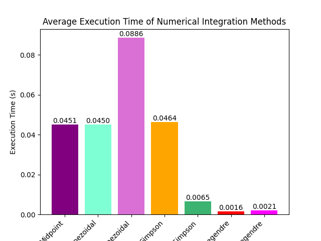

# Homework3_Serafino

This project builds on the previous Homework2, implementing it with Python bindings. For each section, the new implementations will be explicitly highlighted with a further section called "What's new".

## (new!) Code organization
For each module there is a folder which separates source files from header files; the main files (the old main.cpp and the two new mains for each module) are in their folder called main; a cmake and a setup.py are provided and will be explained later on. When executing the mains, a text file with the results and a folder `images` containing the plots is created, they can be found in the `StatisticsModule` and `NumericalIntegrationModule` folders.

## Main
The `main.cpp` was written using switch cases to allow the user to decide what to compute.
* For the Statistics module, it is asked which column of the CSV file to analyse and which analysis perform.
* For the Numerical Integration module, it is asked for convergence tests, polynomial tests and if the user wants to compute the integral of a function from input.  
Being compilable as standalone libraries, a `#if USE_MODULEX` and `#endif` delimit their includes and code in main.cpp.

#### What's new
The switch case in Python is done with the [keyword match](https://www.freecodecamp.org/news/python-switch-statement-switch-case-example/).<br>
Now there are two separate mains for better readability. The computation of an integral from input was not replicated.

## Statistics module
This module computes mean, median, standard deviation, variance, frequency count, classification, and correlation analysis on the data taken from a CSV file on [NBA Players from 2003 to 2022](https://www.kaggle.com/datasets/dhruvsuryavanshi/nba-player-data-from-2003-to-2022/) and outputs them on a file named `player_data_03_22_analysis.txt`.

#### What's new
`DataHandler_py.cpp` provides a Python interface and binding with Pybind11, creating a module called moduleA. Some methods are not wrapped because not useful anymore, those are: readData, read_header, getHeader, getColumn, create_output_path, writeResults.<br>
In fact pandas was used for reading the CSV file, store the names of the columns and each of their datas in just a few lines of code, contrary to the previous C++ version.<br>
Every statistical operation is computed both with the previous functions and with other functions implemented in Python (using NumPy). Except for Classification that is only with Python because the previous function, for some reasons, did not output the results; but since in Python there were less lines of code, it was decided to just stick with it.<br>
Each function is decorated in order to obtain its execution time and comparing it between programming languages.<br>
Since some columns contain non-numerical values, if the user chooses a statistic operation which can't be computed due to the type of values in the column, instead of exiting, they are warned about it and can choose a suitable operation.<br>
When frequency is choosen, a plot of it and its distribution is showed. Before showing every plot, the user is asked to press enter, in this way they don't get suddenly overwhelmed by datas and plots.

### Analysis and observations
* Various statistical calculations are provided, including mean, median, variance, standard deviation, frequency, and correlation.
These calculations can handle data stored in a vector of `std::optional<std::variant<double, std::string>>`. The definition of median is a bit altered in the case of strings in order to adapt it to strings.
* Assertions (assertm) are used to check the validity of input arguments and file operations. They provide a means of catching errors during development.
Exceptions are thrown for cases such as invalid arguments, missing columns, or incompatible data types.
* The Boost library is used for accumulators.

#### What's new
Some analysis about the age and the teams of the players are made.<br>
For the age: mean, median and frequency are executed and a catplot is plotted to better visualize the execution time of each programming language.
  <p align="center">
  <br>
</p>
The numbers over the bars are the deltas of the results between the two languages, thus when it's 0 it means that the results are equal. The frequency results are not written because they would be too many (but later it can be asked for them). For this reason, two plots for it and its distribution are made:
<p align="center">
  <br>
 Frequency counts of Age
</p>
<p align="center">
  <br>
 Distribution of the frequency counts of Age
</p>

For the team, having it non-numerical values, only median and frequency are executed and plotted as before.
<p align="center">
  <br>
</p>
<p align="center">
  <br>
 Frequency counts of Team
</p>
<p align="center">
  <br>
 Distribution of the frequency counts of Team
</p>

## Numerical integration module
This module approximates integrals with the methods midpoint, trapezoidal, Simpson's, two-point Gauss and Gauss-Legendre.  
For this last integration method we used the code provided [here](https://thoughts-on-coding.com/2019/04/25/numerical-methods-in-cpp-part-2-gauss-legendre-integration/) with some edits. For example we defined some constants, like `const double k = M_PI / (n + 0.5)` at line 120 of `IntegrationMethods.cpp`, in order to compute the node as `nodes[i] = cos(k * (i - 0.25))`, avoiding one calculus for each iteration of the for-cycle as in the code of the website. We tested it and unfortunately it has some memory leaks, so we also provided the implementation of twoPointGauss.   
This module is divided in `IntegrationMethods.cpp` and `moduleCfunctions.tpl.hpp` with their headers. The first one has an abstract class `Quadrature` and one derived class for each method. These classes take the integration extremes a and b and the number of subintervals n; in the constructor they calculate relative weights and nodes and through two const methods return them. Moreover the Gauss-Legendre class returns the integration extremes which are necessary to compute the integration, since it's a bit different from the other methods (as you can see from the above linked website). For this reason, in `moduleCfunctions.tpl.hpp` we defined two templates of Integrate. They differ in the use of width and mean (where integration extremes are needed) and for the fact that the function isn't simply evaluated in the node but in $width*\{x_i\} + mean$. In order to evaluate the function, the library muparserx was used. In this file we also calculated the order of convergence (consulting [this website](https://lucia-gastaldi.unibs.it/did2015/automazione/lezioni/quadratura.pdf)), analized and print the relative results. Creating these functions, we can just recall them from the main, providing a clearer design.

#### What's new
`moduleCfunctions_py.cpp` provides a Python interface and binding with Pybind11, creating a module called moduleC. Everything is unchanged except for the GaussLegendre method, which is implemented with NumPy (in `IntegrationMethods.py`) to avoid the above mentioned memory leaks. As numpy.polynomial.legendre module makes only possible to integrate over the interval [-1,1], when defining its test in the main, the interval is internally fixed.<br>
When possible thanks to SciPy integrate functions, a comparison between the integration with them and the previous methods is made in terms of convergence order, result, error, absolute error and time execution (thanks to a time decorator). For Midpoint a comparison is not possible since it doesn't exist a function in Python. Although it's the same for the two-point Gauss, it's worth a comparison with scipy.integrate.quad, since it integrates between two points. Due to this last fact, it would be mathematically inconsistent to compute the convergence order of a method with two nodes, thus it will not be done.
As explained [here](https://docs.scipy.org/doc/scipy/tutorial/integrate.html), with SciPy's Simpson method, for an odd number of samples that are equally spaced, the method is exact if the function is a polynomial of order 3 or less; if the samples are not equally spaced, then the result is exact only if the function is a polynomial of order 2 or less. This means that the Simpson method implemented with C++ should be better, because it has no such limitations.

### Analysis and observations
* The MuParserx library has been employed to facilitate the input of functions as strings, enabling users to calculate integrals interactively.

* Static asserts have been utilized (compile-time checks) to verify that in the functions Integrate and computeConvergenceOrder, the templates are restricted to classes derived from the abstract class Quadrature. Additionally, runtime asserts have been employed to ensure that the input files are well-defined.

* As in the analysis conducted on slide 11 of the [material](https://lucia-gastaldi.unibs.it/did2015/automazione/lezioni/quadratura.pdf), the approach involved assuming the error to conform to the Cn^p form. Subsequently, through the calculation of error across an increasing number of intervals, proportionate to 2^n, and the subsequent comparison with the preceding error on a logarithmic scale, the research determined the value of -p. This value represents the angular coefficient of the line connecting the points (2^n, E(2^n)) and (2^(n+1), E(2^(n+1))). Importantly, this coefficient is defined as the convergence order.

* It was further verified that the Midpoint and Trapezoidal formulas are exact up to polynomials of degree 1, the Simpson formula up to polynomials of degree 3, and the Gauss formula with 2n+1 nodes up to polynomials of degree n.

#### What's new
Not only the convergence order of the methods are computed, but also their averages are computed (10 runs per average); in this way the result is more optimal. Unfortunately sometimes Gauss-Legendre in C++ gives some problems, ruining the plots. Clearly, even though it was integrated with NumPy, there must be something wrong.<br>
<p align="center">
  <br>
 Average Convergence of Numerical Integration Methods
</p>
The more rapidly they descend in the error (y-axis), the higher is the convergence order. Midpoint and Trapezoidal have order 2, Simpson's 4, PyGauss-Legendre 0, while the other Gauss-Legendre fluctuates: until 64 subintervals it is quite good (its error decays reaching peaks of order 4) but then it explodes.
<p align="center">
  <br>
 Average Execution Time of Numerical Integration Methods
</p>
For what concerns the polynomial tests, a catplot is plotted showing the execution time of each method. Though it should be considered that the results are about different integrals with different subintervals, so they must be compared only between the same method and not altogether.
<p align="center">
  <br>
 Execution Time along different integrals and subintervals
</p>

## CMake and libraries
Three CMake are provided: one for each of the two modules and one to actually compile. The two modules have their own namespaces (called MODULEA and MODULEC) and can be compiled both together or independently, setting the option ON from terminal when compiling. The Statistics module also uses the namespace ba for boost::accumulators inside the StatOp.cpp.  
Since the library Boost is shared, it's linked in the CMake to compile; while the library muparserx is only used in the second module and therefore only linked if that module is compiled.  
Everyone in this field should have these libraries installed, if not so, Boost can be downloaded from [the original webpage](https://www.boost.org/) and muparserx from [this zip file on GitHub](https://github.com/beltoforion/muparserx/archive/refs/tags/v4.0.12.tar.gz).  
Since most Boost libraries are header-only, often there is nothing to build; this is our case. While for muparserx it's required to create a folder in which to run the cmake.  
The hardest part was understanding how the three CMake must be written and actually doing it.

#### What's new
Only one CMake is provided, which creates both modules. Also a setup.py is provided, creating a Python package easily installable via pip.
Some Python packages were used: numpy, matplotlib, seaborn, pandas, tabulate. They can be installed with `pip install [names] --user`.<br>
Numpy is used for mathematical operations, especially in the Statistics module; pandas for creating dataframes and reading a CSV file; matplotlib and seaborn for plotting; tabulate to create a table of some results (in the Numerical Integration module).

## How to compile (old version!)
A `CMake` is provided in the main directory.
Create and enter the folder `build`:
```bash
mkdir build && cd build
```
Then run the cmake specifying, if necessary, where the libraries `boost` and `muparserx` are installed. This last one is only needed if you want to compile the module C. By default both modules are set OFF; if you want to set one ON, add the flag `-DUSE_MODULEX=ON` where X is A for the Statistics module and C for the Numerical Integration module. So for example write:
```bash
cmake -DUSE_MODULEA=ON -DUSE_MODULEC=ON ../ -DBOOST_ROOT=/cartella/di/installazione/boost -Dmuparserx_DIR=/opt/muparserx/share/cmake/muparserx
```
Being careful that while for Boost the root folder is enough, for muparserx you must specify the directory containing the file `muparserxConfig.cmake` so it must end with `/share/cmake/muparserx`.  
Lastly write:
```bash
make
```
After a successful building you'll be prompt to write `./homework`.

## How to compile (new version with pip!)
A setup.py is provided and it implicitly calls CMake, thus everything is ready writing:
```bash
python setup.py install --user
```
Or even better just using pip
```bash
pip install --user .
```
Finally to compile each main:
```bash
python main/mainA.py
python main/mainC.py
```